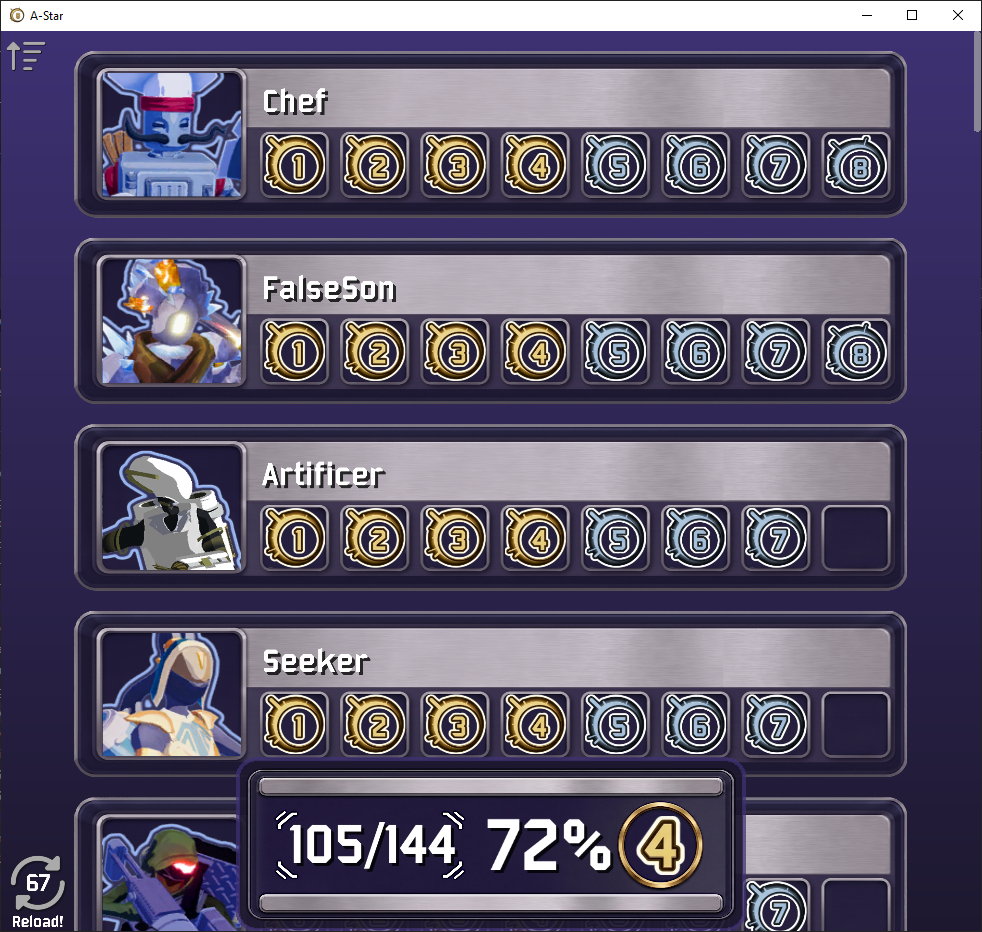
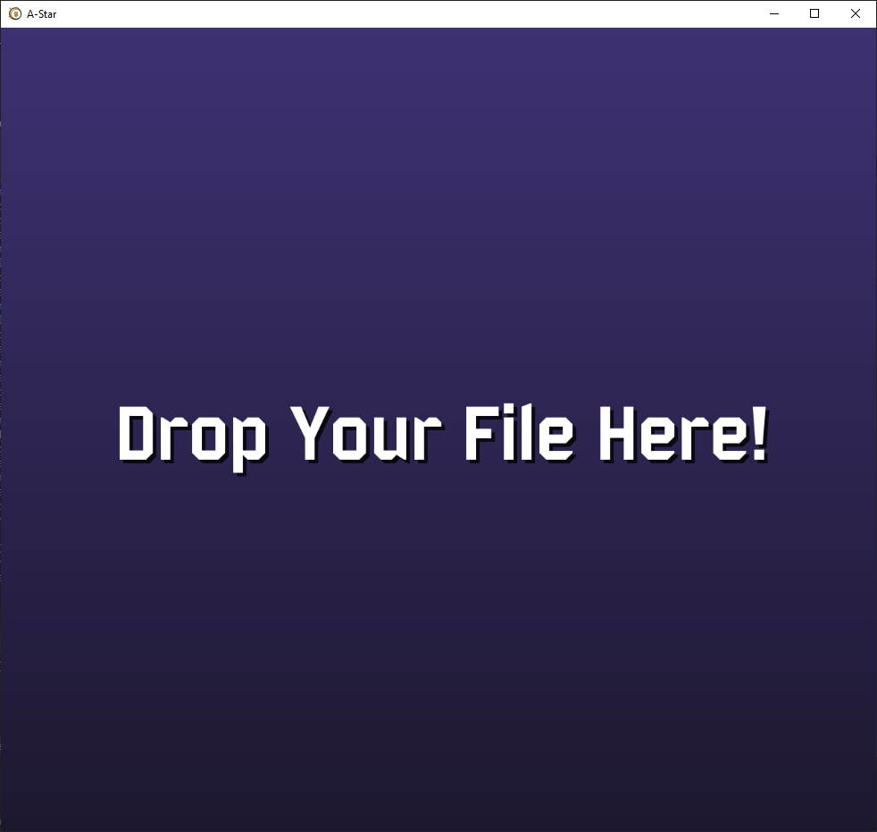

## A-Star

This program was made with the intention to be a better visualization of your progress in the alternate game mode: [Eclipse](https://riskofrain2.fandom.com/wiki/Alternate_Game_Modes#Eclipse) in the game: [Risk Of Rain 2](https://riskofrain.2k.com/).


## How to Use



The program will first load to that screen, it will resort to it wherever the xml file was not found or it was not able to open it.

While at that screen, just drop you xml file containing your eclipse achievements inside of it.

You should be able to find your personal xml file used for the game in that location:\
    ***[YOUR STEAM INSTALLATION LOCATION]\userdata\[YOUR USER ID]\632360\remote\UserProfiles***

## Features

**Hot Reloading** - The program will periodically reload your xml file and update any new stats.\
**File location save** - Your file location will be saved, so you only need to drop it once.\
**Other save files** - You can change of xml file wherever your want, just remove the local file *xml_path.txt* and drop the new file, or change it directly to the new file location.\

## WHY

To put it simply, the visualization inside the game is not particularly great, it doesn't show your progress in a unified matter, just the individual levels or the mastery. 
Since you are likely to interact with it many times in between your various runs, it would be nice to have something more expressive and pleasant to use.\
So i decided to make it!

## How to Build and Run

**Debug Mode**
````
$ .\build.bat 
$ .\main.exe
````

**Release Mode**
````
$ windres ./icon_res/resources.rc -O coff -o resources.res 
$ .\build.bat release
$ .\A-Star.exe
````

The difference here is just the expressive icon and the level of optimization used for compiling everything.
The command "windres" is used to read the icon and output it in a binary format, so the compiler can embed it in the final executable.

## Credits

All the survivor images were taken from the [wiki](https://riskofrain2.fandom.com/wiki/Survivors) hosted on the website [Fandom](https://www.fandom.com/).\
You can find the icon used as the base for the "reload button" here: <a href="https://www.flaticon.com/free-icons/reload" title="reload icons">Reload icons created by Royyan Wijaya - Flaticon</a>

## Raylib 

Please check this amazing library made by Ramon (Ray) Santamaria: [Raylib](https://www.raylib.com/)\
It was used extensively for this project.

## Platforms
At the moment, Windows is the only platform fully supported. 

[!NOTE]
AI was used in the making of the images!
